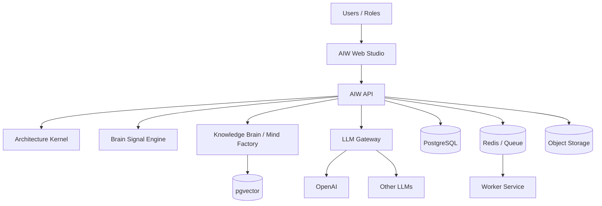
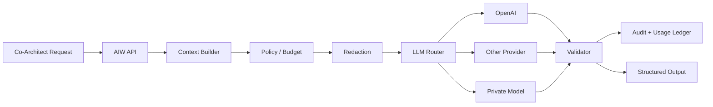
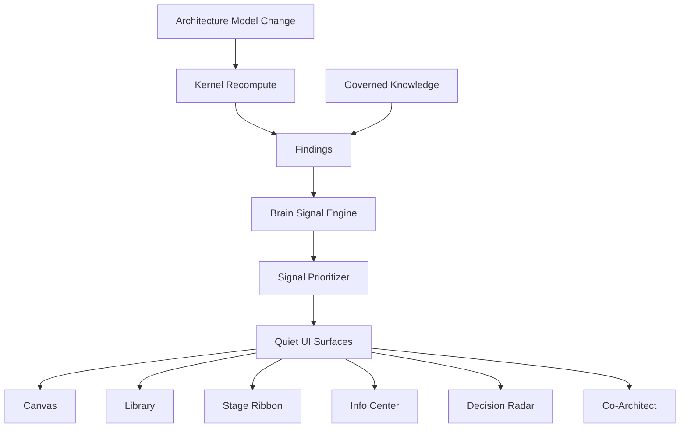
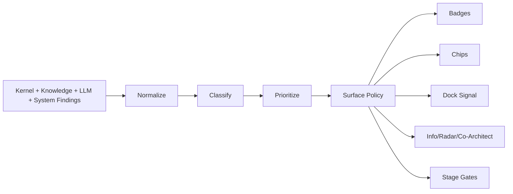
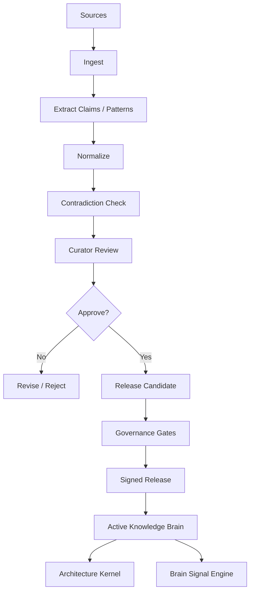
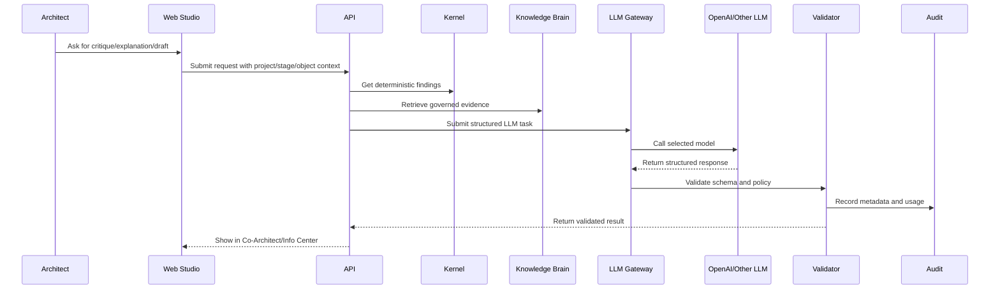
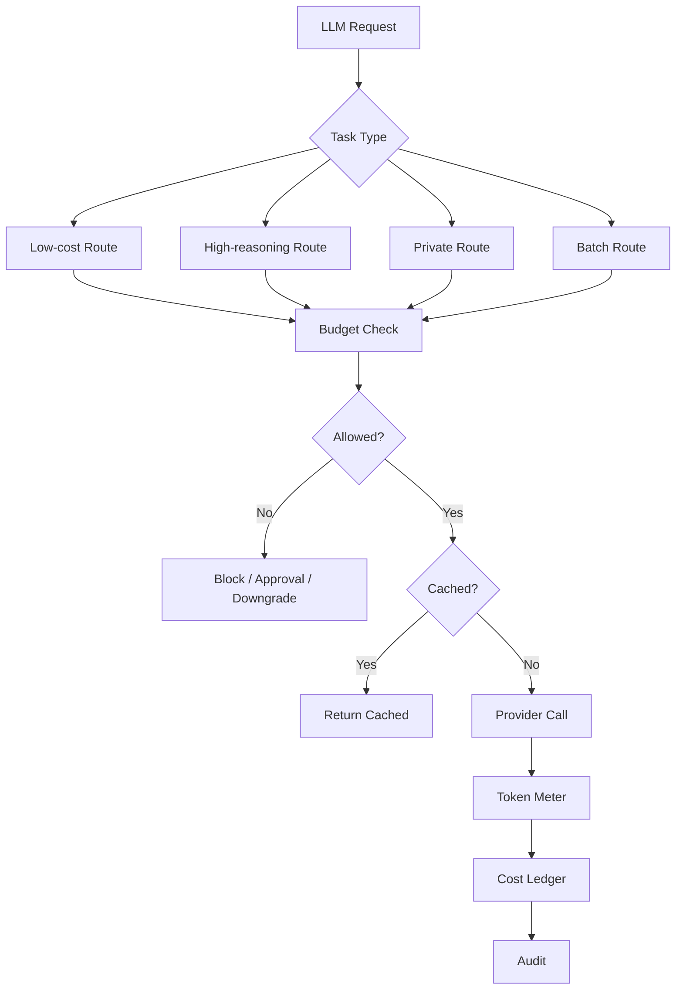
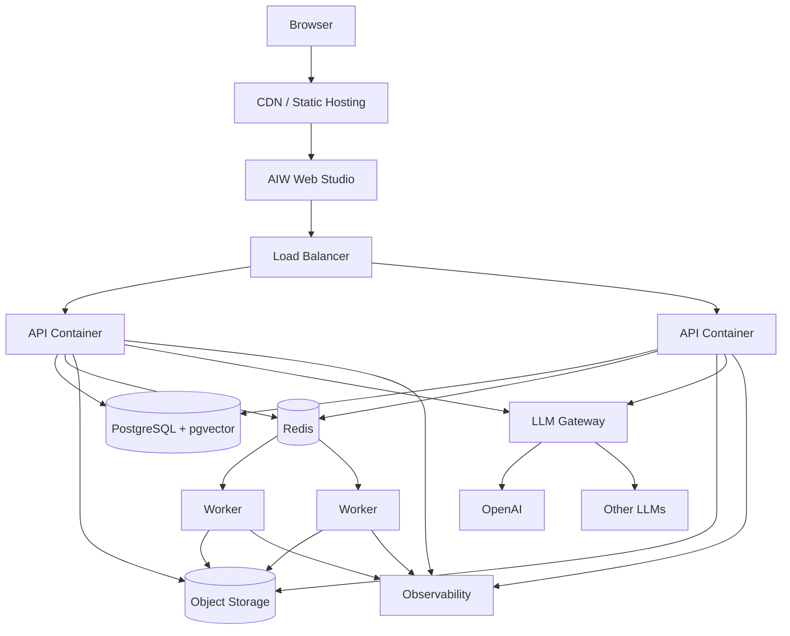
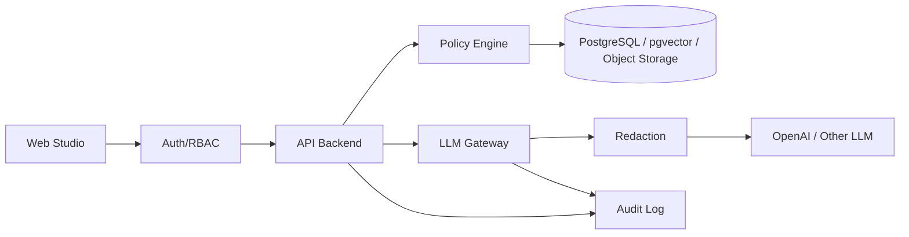

# AIW Architecture Diagrams Pack

This file contains the core architecture diagrams for AIW rc.10.47.3 and beyond.

## 1. High-level product architecture

## 2. LLM provider integration

## 3. Intelligence pipeline

## 4. Brain Signal Engine

## 5. Mind Factory / Knowledge Governance

## 6. Co-Architect sequence

## 7. LLM cost and routing governance

## 8. Production topology

## 9. Security and data boundary

