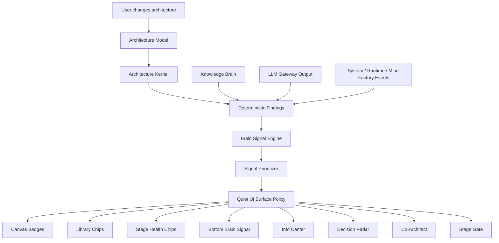

# AIW Brain Signal Engine Architecture

## Purpose

The Brain Signal Engine prevents intelligence from becoming noise.

AIW can internally produce many findings, but the workspace should show only the few that matter in the current context.

## Intelligence flow



## Signal model

```ts
export interface BrainSignal {
  id: string;
  projectId: string;
  stage: ArchitectureStage;
  objectId?: string;
  source: string;
  sourceType: 'deterministic' | 'knowledge' | 'llm' | 'system';
  severity: 'silent' | 'hint' | 'warning' | 'blocker' | 'recommendation' | 'review' | 'evidence' | 'handoff';
  confidence: number;
  title: string;
  shortMessage: string;
  detail?: string;
  recommendedAction?: string;
  evidence?: EvidenceRef[];
  surfacePolicy: SurfacePolicy;
  dismissed?: boolean;
  createdAt: string;
}
```

## Visibility levels

### Level 1 — Silent intelligence

- Library ordering.
- Candidate ranking.
- Default recommendations.
- Readiness score changes.

### Level 2 — Subtle signals

- Canvas badges.
- Library chips.
- Stage chips.
- Hover tooltips.
- Bottom dock one-liner.

### Level 3 — User-invoked intelligence

- Info Center.
- Decision Radar.
- Co-Architect.
- Stage completion gate.

## Noise budget

Recommended default budget:

| Surface | Limit |
|---|---:|
| Canvas badges | 5 visible max |
| Library item chips | 2 per item max |
| Stage ribbon chips | 4 visible max |
| Bottom dock | 1 active signal |
| Info Center | full detail, hidden by default |
| Co-Architect | user-invoked only |
| Toasts | user actions only |

## Prioritization rules

Prioritize by:

1. Blockers before warnings.
2. Current stage before non-current stages.
3. Selected object before unselected objects.
4. Readiness impact before general advice.
5. High confidence before low confidence.
6. New user action before background findings.
7. Undismissed before dismissed.

## Source labeling

Every signal should be explainable as one of:

- deterministic finding,
- knowledge-backed recommendation,
- LLM-assisted explanation,
- governance blocker,
- system/runtime observation.

This protects user trust.
