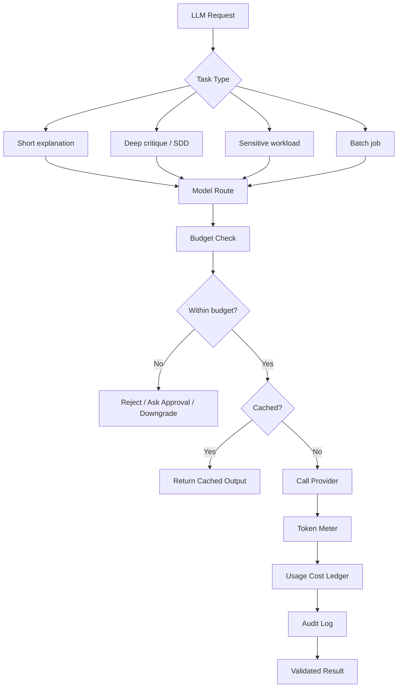

# AIW Cost Governance Architecture

## Cost principle

AIW should be deterministic-first and LLM-budgeted.

LLM calls are powerful but must be deliberate, metered, cached, and routed.

## Cost buckets

1. Compute.
2. Database.
3. Storage.
4. Redis/queue/cache.
5. LLM/API tokens.
6. Observability.
7. Non-production environments.

## LLM cost control model



## Required ledger

```ts
export interface LlmUsageRecord {
  id: string;
  tenantId: string;
  projectId?: string;
  userId?: string;
  taskType: string;
  provider: string;
  model: string;
  routeClass: 'low-cost' | 'high-reasoning' | 'private' | 'batch';
  inputTokens: number;
  outputTokens: number;
  cachedInputTokens?: number;
  estimatedCostUsd: number;
  cached: boolean;
  status: 'allowed' | 'blocked' | 'downgraded' | 'failed' | 'completed';
  createdAt: string;
}
```

## Budget policy

```ts
export interface LlmBudgetPolicy {
  tenantMonthlyUsd: number;
  projectMonthlyUsd?: number;
  userDailyUsd?: number;
  maxRequestUsd?: number;
  requireApprovalAboveUsd?: number;
  allowAutoDowngrade: boolean;
  allowedProviders: string[];
  blockedTaskTypes?: string[];
}
```

## Cost-saving rules

1. Do not call the LLM for deterministic checks.
2. Use the kernel first.
3. Cache repeated explanation requests.
4. Route short explanations to cheaper models.
5. Route deep critique and SDD sections to stronger models only when needed.
6. Batch knowledge extraction where possible.
7. Make expensive actions explicit.
8. Track cost by tenant, project, user, and task.
9. Add admin cost dashboard before commercial rollout.

## Pilot cost posture

For pilot:

- PostgreSQL + pgvector, not a separate vector DB.
- One API + one worker initially.
- Scheduled ingestion, not continuous ingestion.
- Low default LLM budget.
- Strong caching.
- Manual approval for bulk SDD or corpus extraction.
