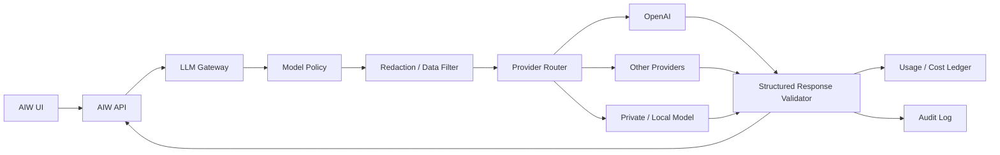

# AIW LLM Gateway Architecture

## Purpose

The LLM Gateway makes OpenAI and other LLM providers safe, controlled, auditable, and replaceable inside AIW.

The gateway prevents these anti-patterns:

- UI components calling OpenAI directly.
- The architecture kernel depending on a specific provider.
- Prompt logic scattered across components.
- Unmetered token usage.
- Ungoverned sensitive architecture data leaving AIW.
- Free-text LLM output becoming official architecture truth.

## Architectural position



## Gateway responsibilities

### 1. Route requests

The gateway selects a route based on:

- tenant policy,
- project policy,
- task type,
- data sensitivity,
- model quality required,
- budget state,
- provider availability.

### 2. Build prompt context

The gateway should receive structured architecture context, not raw UI state.

The context builder should include:

- current lifecycle stage,
- project summary,
- selected architecture objects,
- current drivers/forces,
- accepted style/patterns,
- deterministic findings,
- governed evidence,
- user request,
- output schema.

### 3. Redact and filter sensitive data

The redaction layer should:

- remove secrets,
- remove credentials,
- mask production URLs where needed,
- filter customer data,
- enforce data residency policy,
- restrict provider route for sensitive tasks.

### 4. Enforce budget

Every request should check:

- tenant monthly budget,
- project budget,
- user daily budget,
- task maximum cost,
- expensive action approval requirement.

### 5. Validate structured output

The LLM should return schema-compliant output.

Examples:

- `ArchitectureCritiqueResponse`
- `StyleRecommendationExplanation`
- `PatternRecommendationExplanation`
- `InterfaceSuggestionResponse`
- `SDDSectionDraftResponse`
- `DecisionRadarResponse`

Free text should be accepted only as a field inside a structured response.

### 6. Audit and meter usage

Every request should produce:

- tenant ID,
- project ID,
- user ID,
- task type,
- provider,
- model,
- token usage,
- estimated cost,
- cache hit/miss,
- policy route,
- response validation status.

## Provider strategy

Recommended starting strategy:

```text
Primary provider: OpenAI
Secondary provider: optional alternate cloud LLM
Private provider: optional private/local model endpoint
Routing authority: AIW LLM Gateway
Official architecture truth: AIW Kernel + Knowledge Brain
```

## Task routing examples

| Task | Route class | Notes |
|---|---|---|
| Short explanation | low-cost | Can use smaller/cheaper model |
| Deep architecture critique | high-reasoning | May require stronger model |
| SDD section drafting | high-reasoning or batch | Should use structured output |
| Sensitive enterprise design | private/local or approved provider | Redaction required |
| Bulk knowledge extraction | batch/async | Worker-owned |
| Deterministic style scoring | no LLM | Kernel-owned |
| Compliance pass/fail | no LLM | Kernel/governance-owned |

## Non-negotiable rule

The LLM response is a proposal, explanation, or draft. It is not automatically an approved architecture decision.
