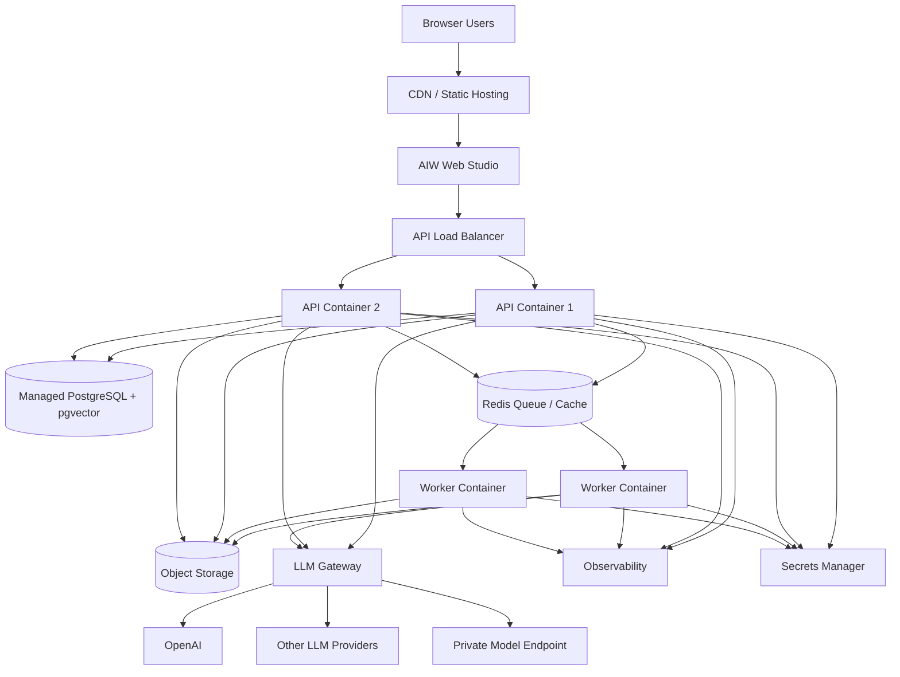

# AIW Production Deployment Architecture

## Recommended deployment path

AIW should start with managed containers, not Kubernetes.

Recommended pilot/enterprise architecture:

```text
Frontend: Static CDN
Backend: API container
Worker: Separate worker container
Database: Managed PostgreSQL + pgvector
Queue/cache: Redis
Storage: Object storage
Secrets: Secret manager
Auth: OIDC/SAML-ready
Observability: OpenTelemetry + managed logs
LLM: AIW LLM Gateway
```

## Topology



## Why not Kubernetes immediately?

AIW's current product risk is not orchestration maturity. The core risks are:

- design-intelligence correctness,
- knowledge governance,
- LLM cost control,
- workspace clarity,
- evidence/provenance,
- auditability,
- production verification.

Managed containers reduce operational overhead while remaining production credible.

## Environment model

Recommended environments:

1. Local development.
2. Test/CI.
3. Staging/demo.
4. Production pilot.
5. Production commercial later.

## Minimum production controls

- TLS everywhere.
- OIDC/SAML-ready auth.
- Tenant-aware data model.
- Secret manager.
- Backups and restore drill.
- Redis queue visibility.
- OpenTelemetry logs/metrics/traces.
- Error monitoring.
- LLM token/cost ledger.
- Audit logs for decisions, model changes, knowledge releases, and LLM requests.

## Deployment stages

### Stage 1 — Lean pilot

- One API container.
- One worker container.
- Small PostgreSQL instance.
- Small Redis.
- Static web hosting.
- External LLM provider.

### Stage 2 — Enterprise pilot

- Two API containers behind load balancer.
- Worker pool.
- Managed PostgreSQL with backups/PITR.
- Managed Redis.
- Strong observability.
- OIDC integration.

### Stage 3 — Commercial SaaS

- Multi-tenant control plane.
- API and worker autoscaling.
- Tenant-aware data isolation.
- Metering/billing.
- Data residency policies.
- Stronger audit/event store.
