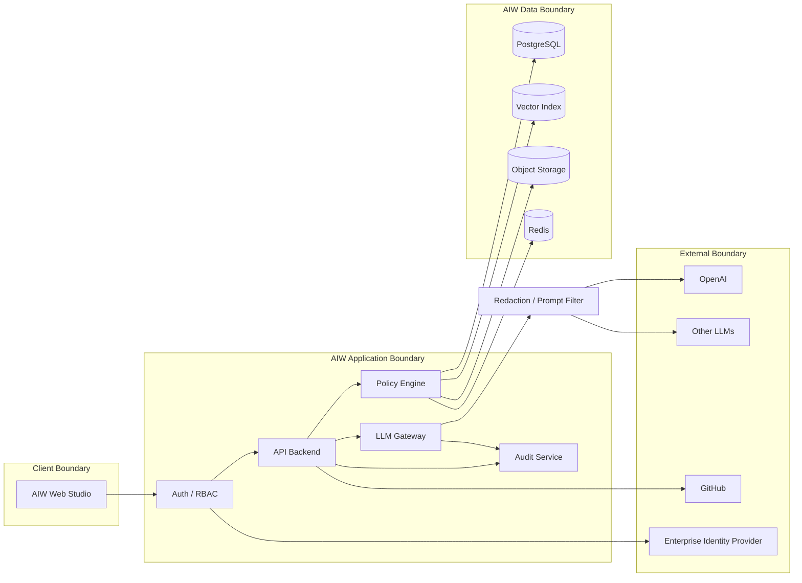

# AIW Security and Data Boundaries

## Boundary model

## Key rules

1. No secrets in prompts.
2. No direct UI-to-LLM calls.
3. No raw production credentials in architecture model exports.
4. No unapproved knowledge source activation.
5. No final architecture decision from LLM output alone.
6. Tenant-aware data model from the beginning.
7. All LLM requests logged with metadata.
8. Prompt/response storage policy must be configurable.
9. Redaction is mandatory before external provider calls.
10. Sensitive projects can be routed only to approved private/local providers.

## Audit events

AIW should audit:

- project created/updated,
- model object created/updated/deleted,
- relationship created/updated/deleted,
- stage completed/reopened,
- style accepted,
- pattern accepted,
- obligation armed/resolved,
- knowledge record approved/released,
- LLM request made,
- SDD generated/downloaded,
- admin setting changed,
- provider route changed.
