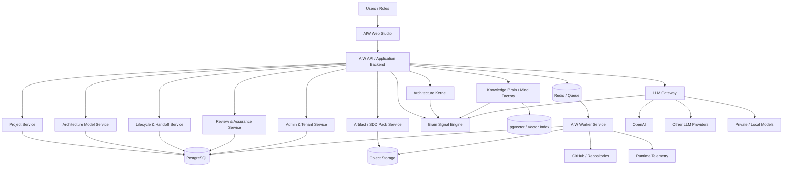

# AIW Target Software Architecture

## Architecture position

AIW is a governed software architecture design platform, not a generic AI wrapper.

The product should be understood as:

1. A guided architecture design studio.
2. A deterministic architecture kernel.
3. A governed knowledge brain / Mind Factory.
4. A quiet Brain Signal Engine.
5. A controlled LLM Gateway.
6. A lifecycle, review, and SDD artifact platform.
7. A production control plane for governance, cost, audit, and deployment readiness.

## High-level component map



## Architectural rule

The LLM can recommend, explain, draft, and critique.

AIW must verify, constrain, govern, and decide what becomes official.

## Major components

### 1. Web Studio

The Web Studio provides:

- Project Hub.
- Project Cockpit.
- Guided architecture lifecycle.
- Architecture canvas.
- Stage library / Architecture Kit.
- Info Center.
- Decision Radar.
- Co-Architect.
- Admin and Knowledge Ops surfaces.

The frontend should render quiet intelligence signals, not raw kernel findings or raw LLM output.

### 2. API Backend

The API backend owns:

- Project CRUD.
- Architecture model persistence.
- Lifecycle stage state.
- Handoff ledger.
- SDD artifact generation orchestration.
- Knowledge governance APIs.
- LLM gateway invocation.
- Audit and usage ledger recording.

### 3. Architecture Kernel

The kernel owns deterministic intelligence:

- Quality-driver analysis.
- Style fit scoring.
- Pattern fit scoring.
- Component/object completeness.
- Interface semantics.
- Drop preflight.
- Obligation generation.
- Review checks.
- SDD readiness.

### 4. Knowledge Brain / Mind Factory

The Knowledge Brain owns governed knowledge:

- Architecture styles.
- Patterns.
- Tactics.
- Object/component kits.
- Topology templates.
- Obligations.
- Evidence and provenance.
- Knowledge release status.

Mind Factory manages ingestion, claim review, contradiction handling, curation, release, and activation.

### 5. Brain Signal Engine

The Brain Signal Engine normalizes findings from deterministic, knowledge, LLM, and system sources into one consistent signal model.

It answers:

- What matters now?
- How severe is it?
- Where should it appear?
- Should it remain silent?
- Should it block stage handoff?

### 6. LLM Gateway

The LLM Gateway owns:

- Model provider abstraction.
- Provider routing.
- Prompt context construction.
- Sensitive-data redaction.
- Budget enforcement.
- Structured output validation.
- Usage ledger.
- Audit logging.
- Provider fallback.

No UI component should call OpenAI/LLMs directly.

### 7. Worker Service

Workers own long-running or background tasks:

- Knowledge ingestion.
- Repository scans.
- Pattern calibration.
- SDD pack generation.
- Long-running reviews.
- Durable event processing.

## Target package/service map

```text
@aiw/web
@aiw/api
@aiw/worker
@aiw/kernel
@aiw/knowledge
@aiw/brain
@aiw/llm-gateway
@aiw/artifacts
@aiw/integrations
```

This physical separation can be incremental. The key requirement is architectural separation even if the implementation starts as modules inside existing packages.
